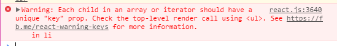

**  
    * Created by  on Dengshuo 2017/9/20.    
*/
# 1. ES6        
如今前端很多框架都改用ES6的语法来写，React 也不例外，所以在学习该框架之前首先了解一下 ES6 是很有必要的，否则面对 React 你会不知所云，主要会用到let 语句、const 声明、箭头函数、类、模板字符串等，推荐在 [这个网址](http://es6.ruanyifeng.com/#README) 上学习，这里有全新的 JavaScript 引入的语法新特性。
# 2. React
React 中文官网： [https://discountry.github.io/react/](https://discountry.github.io/react/) 
## 2.1 安装React  
使用 Create React App 是创建新的 React 应用的最好方式。它可以设置好开发环境，用 Babel 把浏览器还不支持的 ES6 语法转换为 ES5 ，可让你使用最新的  JavaScript 特性。  
在使用 Creatte React App 之前，首先应安装自己对应系统版本的 node.js ，然后在 Windows 下打开 cmd ，运行如下代码：
```cmd
npm install -g create-react-app  
create-react-app my-app  
cd my-app  
npm start
``` 
## 2.2 React 组件  
组件 (components) 的意义是把组成页面的各个小块独立出来，达到组件复用的目的，而且可以独立地思考每个模块。从概念上说，组件就像一个 js 函数，它可接收特定的输入 (props) 并返回 React 元素，让页面来展示我们想要展现的东西。组件分为函数化的组件和类组件，例如： 
```JavaScript
 function Welcome(props){
    return <h1> Hello, {props.name} </h1>   
}  
```
和
```JavaScript
class Welcome extends React.Component{
    render(){
        return <h1>Hello, {this.props.name}</h1>
    }
}
```  
这两种写法从某些方面说是一样的，但是 class 类组件拥有一些额外的特性,如构造器 constructor。在日常使用中我们用到最多的也是class，可通过下面五步将一个函数化组件转换为class：

(1) 创建一个相同名字的 ES6 class 扩展自 React.Component；  
(2) 在 class 内添加一个空的方法 render();  
(3) 将原先函数内的主体放入 render() 方法；  
(4) 将 render() 里面的props 替换成 this.props；  
(5) 将原来的空函数删除；  

在一个组件中我们可以嵌入另外的组件，这样我们就可以重用不同抽象程度的组件，例如：
```JavaScript
function Welcome(props){
    return <h1>Hello, {props.name}</h1>
}
function App(){
    return (
        <div>
            <Welcome name='Sara' />
            <Welcome name='Cahal' />
            <Welcome name='Edite' />
        </div>                
    );
}
ReactDOM.render(
    <App />,
    document.getElementById('root')
)
```  
注意每个组件都要用 / 闭合，否则会报错。  
## 2.3 状态和状态提升 
在 React 中，开发者只需要更新组件的状态，然后根据此新状态呈现新的 UI，在呈现新的 UI 时，React 具有局部更新的特点，即：React 只渲染有变化的部分。当我们用 class 来定义组件的时候，以下面的例子说明通过三步将 date 从 props 移到状态内：
```JavaScript
class Clock extends React.Component {
    constructor(props) {
        super(props);
            this.state = {date: new Date()};
        }
    render() {
        return (
            <div>
                <h1>Hello, world!</h1>
                <h2>It is {this.state.date.toLocaleTimeString()}.</h2>
            </div>
        );
    }
}
ReactDOM.render(
    <Clock />,
    document.getElementById('root')
);
```
(1) 将 render() 方法内用 this.state.date;  
(2) 添加一个构造器并给一个初始状态 this.state;  
(3) 从 <Clock /> 中删除 date;   

当需要相应用户的输入、服务器请求或时间的推移时，需要为组件添加 state，其他情况应保持组件的无状态。而且使尽可能多的组件处于无状态，这样可以将状态隔离到合理的位置，减少冗余。  

当使用状态时，用 this.state() 定义初始状态，通过 this.state 获取，在页面中需要用事件修改组件状态时，用 this.setState() 方法修改。在 render() 的内部会根据这个状态作出相应，每次更新状态后，都会自动调用 this.render() 方法重新渲染组件。 

使用 React 时经常会遇到几个组件需要共用状态数据的情况，这时候我们最好把要共用的状态数据提升到它们最近的父组件中进行管理。React 状态提升就是用户对子组件操作，子组件不改变自己的状态，通过自己的 props 把这个操作改变的数据传递给父组件，改变父组件的状态，从而改变父组件所控制的所用子组件的状态，这也是 React 单向数据流的特性决定的。  
## 2.4 组件的生命周期 
在我学习 React 之初，只更多地去关注组件间的状态传递而不太注重生命周期，其实生命周期的作用是通过定义几个函数来控制组件在各个阶段的动作，实际应用中使用用生命周期也相当频繁。 

在 React 中，触发 render 有4条路径： 

(1) 首次渲染 Initial Render；    
(2) 调用 this.setState (React 可能会把多次 setState 合并操作，再一次性进行 render )；   
(3) 父组件发生更新 (一般就是 props 发生改变，但是就算 props 没有改变或者父子组件之间没有数据交换也会触发 render)；   
(4) 调用 this.forceUpdate；   

这四条 React 组件更新路径总结如下：
  

这几个生命周期相关的函数有：
```JavaScript
constructor(props, context)
```
构造函数，在创建组件的时候调用一次。

```JavaScript
void componentWillMount()
```
在组件挂载之前调用一次。如果在这个函数里面调用setState，本次的render函数可以看到更新后的state，并且只渲染一次。  
```JavaScript
void componentDidMount()
```        
在组件挂载之后调用一次。这个时候，子主键也都挂载好了，可以在这里使用refs。
```JavaScript
void componentWillReceiveProps(nextProps)
```
props是父组件传递给子组件的。父组件发生render的时候子组件就会调用componentWillReceiveProps（不管props有没有更新，也不管父子组件之间有没有数据交换）。

```JavaScript
bool shouldComponentUpdate(nextProps, nextState)
```        
组件挂载之后，每次调用setState后都会调用shouldComponentUpdate判断是否需要重新渲染组件。默认返回true，需要重新render。在比较复杂的应用里，有一些数据的改变并不影响界面展示，可以在这里做判断，优化渲染效率。  

```JavaScript
void componentWillUpdate(nextProps, nextState)
```        
shouldComponentUpdate返回true或者调用forceUpdate之后，componentWillUpdate会被调用。

 ```JavaScript
void componentDidUpdate()
```       
除了首次render之后调用componentDidMount，其它render结束之后都是调用componentDidUpdate。    
componentWillMount、componentDidMount和componentWillUpdate、componentDidUpdate可以对应起来。区别在于，前者只  有在挂载的时候会被调用；而后者在以后的每次更新渲染之后都会被调用。

```JavaScript
ReactElement render()
```        
render是一个React组件所必不可少的核心函数（上面的其它函数都不是必须的）。记住，不要在render里面修改state。

```JavaScript
void componentWillUnmount()
```        
组件被卸载的时候调用。一般在componentDidMount里面注册的事件需要在这里删除。
## 2.5 事件处理
React 事件处理与原生的事件处理有一些差异，具体表现在：  

(1) React 使用驼峰事件命名，不是小写，如 onClick；  
(2) 采用 JSX 语法时需传入一个函数作为事件处理函数，而不是一个字符串，如下例：
```JavaScript
//原生的写法
<button onclick="activateLasers()">
    Activate Lasers
</button>
```
```JavaScript
//react写法
<button onClick={activateLasers}>
    Activate Lasers
</button>
```        
(3) 阻止浏览器默认行为，原生事件处理，可以通过返回false来阻止阻止浏览器默认行为，也可以通过调用事件对象的preventDefault方法来实现。而react只能通过调用preventDefault来实现。  
 ```JavaScript
//原生的处理方式  
<a href="#" onclick="console.log('The link was clicked.'); return false">
    Click me
</a>
```
```JavaScript
//在react中  
function ActionLink() {
    function handleClick(e) {
        e.preventDefault();
        console.log('The link was clicked.');
    }

    return (
        <a href="#" onClick={handleClick}>
            Click me
        </a>
    );
} 
```    

实例： 在页面实现按钮开关    
在Toggle组件中，返回了button，根据状态显示on/off文案，并且监听点击事件，回调函数为handleClick，在回调中设置组件的状态，state改变后，则又调用render方法，更新UI。  
```JavaScript
class Toggle extends React.Component {
    constructor(props) {
        super(props);
        this.state = { isToggleOn: true };
        this.handleClick = this.handleClick.bind(this);
    }
    handleClick() {
        this.setState(prevState => ({
            isToggleOn: !prevState.isToggleOn
        }));
    }
    render() {
        return (
            <button onClick={this.handleClick}>
                {this.state.isToggleOn ? 'ON' : 'OFF'}
            </button>
        );
    }
}
ReactDOM.render(
    <Toggle />,
    document.getElementById('root')
);
```        
此处bind函数很有意思：先来看，bind的函数作用：改变函数执行的上下文，也就是this的指向。bind函数会创建一个新的函数，称为绑定函数，并且调用的时候上下文指向创建时传入的第一个参数。 

在本例中，点击出发onClick事件后，执行this.handleClick，此时的this指向是当前Toggle对象。如果不使用bind函数，还可以使用属性初始化语法，也可以直接在钩子函数处使用箭头函数：
```JavaScript
handleClick = () => {
    this.setState(prevState => ({
        isToggleOn: !prevState.isToggleOn
    }));
}
render() {
    return (
        <button onClick={(e) => this.handleClick(e)}>
            Click me
        </button>
    );
}
```        
## 2.6 条件渲染
我们常会在一个页面中创建多个组件，然后根据实际需求来显示不同的组件，这时会用到条件渲染，根据应用的状态变化只渲染部分组件。常见的条件渲染有以下几种方式：
* if 语句：最简单的条件渲染，适用于新手，使用 if，从渲染方法中返回 null 提前退出函数：
```JavaScript
function List({ list }) {
    // list 为null的情况
    if (!list) {
        return null;
    }

    // list 为空的情况
    if (!list.length) {
        return <p>sorry, the list is empty</p>
    } else {
        return (
            <div>
                {list.map(item => <ListItem item={item} />)}
            </div>
        );
    }
}
```        
* 逻辑 && 运算符：不返回元素就返回 null 时使用：
```JavaScript
function LoadingIndicator({ isLoading }) {
    return (
        <div>
            { isLoading && <p>Loading...</p> }
        </div>
    );
}
```        
* 三元运算符：比 if-else 更好更简洁，优先使用：
 ```JavaScript
 function Item({ item, mode }) {
    const isEditMode = mode === 'EDIT';

    return (
        <div>
        { isEditMode
            ? <ItemEdit item={item} />
            : <ItemView item={item}>
        }
        </div>
    );
}
```      
* switch..case.. 语句：比较冗长，可以通过立即调用函数内联使用：
 ```JavaScript
function Notification({ text, state }) {
    switch (state) {
        case 'info':
        return <Info text={text} />;
        case 'warning':
        return <Warning text={text} />;
        case 'info':
        return <Info text={text} />;
        default:
        return null;
    }
}
```       
注意switch...case语句永远要加上default情况，因为React组件要么返回元素，要么返回null。

* 枚举(enums)：超过一种条件选择时使用，是多条件渲染中很好的一种方式，上面的 Notification 组件可以写为：
```JavaScript
function Notification({text, state}){
    return (
        <div>
            {{
                info: <Info text={text} />,
                warning: <Warning text={text} />,
                error: <Error text={text} />
            }[state]}
        </div>
    )
}
```        
## 2.7 表单基础
在 React 中，修改表单的唯一途径是使用 setState 方法，例如：
```JavaScript
class NameForm extends React.Component {
    constructor(props) {
        super(props);
        this.state = {value: ''};

        this.handleChange = this.handleChange.bind(this);
        this.handleSubmit = this.handleSubmit.bind(this);
    }

    handleChange(event) {
        this.setState({value: event.target.value});
    }

    handleSubmit(event) {
        alert('A name was submitted: ' + this.state.value);
        event.preventDefault();
    }

    render() {
        return (
        <form onSubmit={this.handleSubmit}>
            <label>
                Name:
                <input type="text" value={this.state.valueonChange={this.handleChange} />
            </label>
            <input type="submit" value="Submit" />
        </form>
        );
    }
}
ReactDOM.render(
    <NameForm />,
    document.getElementById('root')
);
```        
上例注解：首先将组建渲染到页面，及执行了 render()，此时获取的 value 为空，当我们输入数据时，触发 handleChange 函数 (注意：要提前绑定在当前环境下)，然后设置 state 中的 value 为用户当前输入值，于是表单元素 input 获取到最新的 state 并使用虚拟 dom 与真实 dom 作对比，只更新有变化的 dom，当点击提交按钮时，触发了 handleSubmit 函数。
## 2.8 列表 & Keys
多组件渲染时，可以创建元素集合，并用一对大括号 {} 在 JSX 中直接将其引用，如下，用 map() 函数将 numbers 数组循环处理，每一项都返回一个 `<li>` 元素：
```JavaScript
 const numbers = [1,2,3,4];
const listItems = numbers.map((number) => 
    <li>{number}</li>
);
ReactDOM.render(
    <ul>{listItems}</ul>,
    document.getElementById('root')
)
```       
这个例子只是简单的元素列表的创建过程，而在 React 中，我们要用到的是组件列表的创建：
 ```JavaScript
function ListItem(props) {
    const numbers = props.numbers;
    const listItems = numbers.map((number) =>
        <li>{number}</li>
    );
    return (
        <ul>{listItems}</ul>
    );
}

const numbers = [1, 2, 3, 4, 5];
ReactDOM.render(
    <ListItem numbers={numbers} />,
    document.getElementById('root')
);
```       
这样就转化成了基本的 React 组件样式了，但是运行时会得到一个警告：
>  

上面的警告告诉我们数组中的每一个元素都需要一个"Key" (键) 来进行标识。键 (Keys) 帮助 React 标识哪个项被修改、添加或者移除。挑选 Key 最好的方法是使用一个在它的同辈元素中不重复的标识字符串，多数情况下可使用数据中的 IDs 作为 keys，例如：
 ```JavaScript
const todoItems = todos.map((todo) => 
    <li key={todo.id}>{todo.text}{</li>
);
```       
当要渲染的列表项中没有稳定的 IDs 时，可以使用数据项的索引值作为 key 的最后选择：
 ```JavaScript
const todoItems = todos.map((todo,index) =>
    <li key={index}>{todo.text}</li>
);
```        
# 3. Ant Design of React
Ant Design of React 学习官网：[https://ant.design/docs/react/introduce-cn](https://ant.design/docs/react/introduce-cn)
## 3.1 开发环境配置
使用 npm 或 yarn 安装：
```cmd
npm install antd --save
```
或
```cmd
yarn add antd
```
当我们要用到 antd 中的某个组件时，用 import 将其引入，例如：
 ```JavaScript
 import { DatePicker } from 'antd';
ReactDOM.render(<DatePicker />, mountNode);
```      
引入样式：
```JavaScript
import 'antd/dist/antd.css';
```        
在上一章节我们学习 React 时是用 create-react-app 工具创建项目，当我们需要在工程中引入 antd 时，可以这样做：  
(1) 除了安装 create-react-app ，还要安装 yarn
```cmd
npm install -g create-react-app yarn
```
(2) 创建一个项目
```cmd
create-react-app antd-demo
```        
(3) 进入项目并启动
```cmd
cd antd-demo
yarn start
```
如果这时访问 http://localhost:3000/，看到 Welcome to React 的界面表示成功；  
(4) 用 yarn 或 npm 引入 antd
```cmd
yarn add antd
```
(5) 对 create-react-app 的默认配置进行自定义，这里我们使用 react-app-rewired （一个对 create-react-app 进行自定义配置的社区解决方案）
```cmd
yarn add react-app-rewired --dev
```        
```JavaScript
/* package.json */
"scripts": {
-   "start": "react-scripts start",
+   "start": "react-app-rewired start",
-   "build": "react-scripts build",
+   "build": "react-app-rewired build",
-   "test": "react-scripts test --env=jsdom",
+   "test": "react-app-rewired test --env=jsdom",
}
```
然后在项目根目录创建一个 config-overrides.js 用于修改默认配置。
```JavaScript
module.exports = function override(config, env) {
    return config;
};
```
(6) 使用 babel-plugin-import ---是一个用于按需加载组件代码和样式的 babel 插件
```cmd
yarn add babel-plugin-import --dev
```        
修改 config-overrides.js 文件：
```JavaScript
+ const { injectBabelPlugin } = require('react-app-rewired');
    module.exports = function override(config, env) {
        +   config = injectBabelPlugin(['import', { libraryName: 'antd', style: 'css' }], config);
    return config;
    };
```
这时候就可以在项目中引入要用到的 antd 的模块：
```JavaScript
// scr/App.js
import React, { Component } from 'react';
- import Button from 'antd/lib/button';
+ import { Button } from 'antd';
import './App.css';

class App extends Component {
    render() {
    return (
        <div className="App">
        <Button type="primary">Button</Button>
        </div>
    );
    }
}
export default App;
```
(7) 自定义主题：按照配置主题的要求，自定义主题需要用到 less 变量覆盖功能。我们可以引入 react-app-rewire 的 less 插件 react-app-rewire-less 来帮助加载 less 样式
```cmd
yarn add react-app-rewire-less --dev
```        
修改 config-overrides.js 文件：
```JavaScript        
const { injectBabelPlugin } = require('react-app-rewired');
    + const rewireLess = require('react-app-rewire-less');

    module.exports = function override(config, env) {
    -   config = injectBabelPlugin(['import', { libraryName: 'antd', style: 'css' }], config);
    +   config = injectBabelPlugin(['import', { libraryName: 'antd', style: true }], config);
    +   config = rewireLess(config, env, {
    +     modifyVars: { "@primary-color": "#1DA57A" },
    +   });
        return config;
        };
```
## 3.2 组件使用
当我们配置好开发环境后，就可以在项目中引入任意想要的模块，只要 `import { ... } from 'antd';` 就可使用。